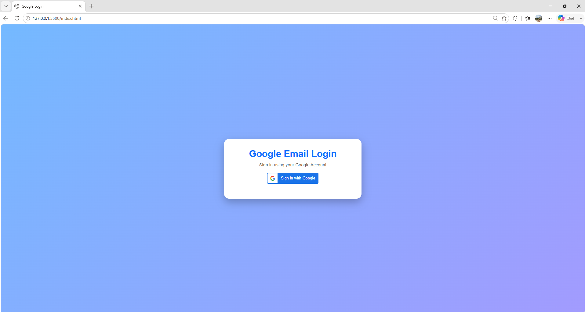
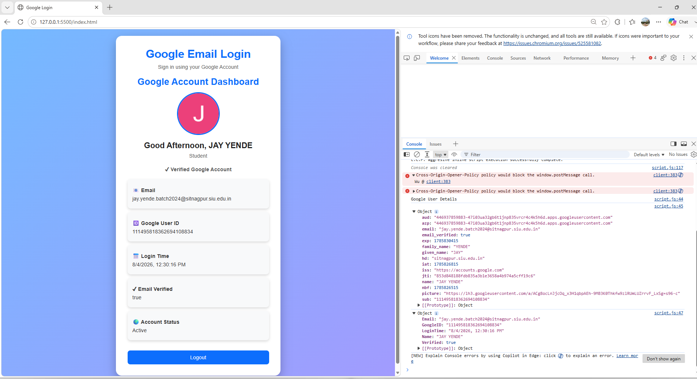
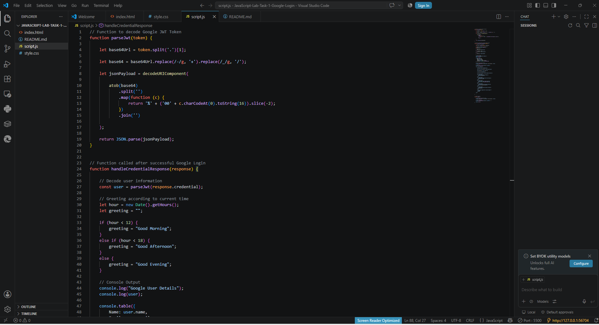

<div align="center">

# 🔐 Google Email Login Dashboard

### A Modern Google Authentication Dashboard built using HTML, CSS, JavaScript & Google Identity Services API

<p align="center">


</p>

---

A modern and responsive **Google Email Login Dashboard** developed using **HTML5, CSS3, JavaScript (ES6)** and **Google Identity Services API**.

The application allows users to securely sign in with their Google account and displays a personalized dashboard containing their profile information, authentication details, login timestamp, and account status.

</div>

---

# 🚀 Features

- 🔑 Secure Google Sign-In Authentication
- 👤 Personalized User Dashboard
- 📷 Google Profile Picture
- 👋 Dynamic Greeting (Morning / Afternoon / Evening)
- 📧 Email Display
- 🆔 Google User ID
- ✔ Email Verification Status
- 📅 Current Login Time
- 🌍 Account Status
- 🚪 Logout Functionality
- 🎨 Modern Responsive UI
- 📱 Mobile Friendly Design
- 💻 Console Logging using `console.log()` and `console.table()`
- ⚡ Fast and Lightweight

---

# 📸 Project Screenshots

## 🟢 Login Screen



---

## 🟢 User Dashboard

.png)

---

## 🟢 Dashboard (After Login)

.png)

---

## 🟢 Browser Console



---

## 🟢 VS Code Project



---

# 🛠 Technologies Used

| Technology | Purpose |
|------------|---------|
| HTML5 | Webpage Structure |
| CSS3 | Styling & Responsive Design |
| JavaScript (ES6) | Application Logic |
| Google Identity Services API | Google Authentication |
| Google OAuth 2.0 | Secure User Login |

---

# 📂 Project Structure

```
Google-Email-Login-Dashboard
│
├── assets
│   └── screenshots
│       ├── Console.png
│       ├── Login_Page.png
│       ├── Login_Page_Dashboard(1).png
│       ├── Login_Page_Dashboard(2).png
│       └── VSCODE.png
│
├── index.html
├── style.css
├── script.js
├── README.md
└── LICENSE
```

---

# ⚙️ Installation

### Step 1

Download or Clone this repository.

```
git clone https://github.com/YOUR_GITHUB_USERNAME/Google-Email-Login-Dashboard.git
```

---

### Step 2

Open the project using **Visual Studio Code**.

---

### Step 3

Install the **Live Server** extension.

---

### Step 4

Create a Google Cloud project.

- Configure Google Identity Services
- Create OAuth Client ID
- Replace your Client ID in **index.html**

---

### Step 5

Run

```
index.html
```

using **Live Server**.

---

### Step 6

Click

```
Sign in with Google
```

to access the dashboard.

---

# 📚 Concepts Implemented

- Google Authentication
- Google Identity Services API
- OAuth 2.0
- JWT Token Parsing
- DOM Manipulation
- Event Handling
- JavaScript Functions
- Template Literals
- CSS Flexbox
- CSS Animations
- Responsive Web Design

---

# 🎯 Learning Outcomes

This project demonstrates practical implementation of:

- Secure Google Login
- Third-Party Authentication
- JavaScript DOM Manipulation
- Dynamic Dashboard Creation
- Responsive UI Design
- API Integration
- User Authentication Workflow
- Modern Frontend Development

---

# 🔮 Future Enhancements

- 🌙 Dark Mode
- 📊 Dashboard Analytics
- 🔔 Notifications
- 🌤 Weather Widget
- 📝 Notes Application
- ☁ Firebase Authentication
- 💾 Database Integration
- 👥 Multiple User Support
- 📱 Progressive Web App (PWA)

---

# 👨‍💻 Author

## Jay Yende

**B.Tech Computer Science Engineering**

**Symbiosis Institute of Technology, Nagpur**

GitHub Profile:
https://github.com/Jayyende

---

# ⭐ Support

If you found this project useful,

please consider giving it a **⭐ Star** on GitHub.

It motivates me to build more projects.

---

<div align="center">

## Thank You ❤️

Made with HTML • CSS • JavaScript • Google Identity Services API

</div>
